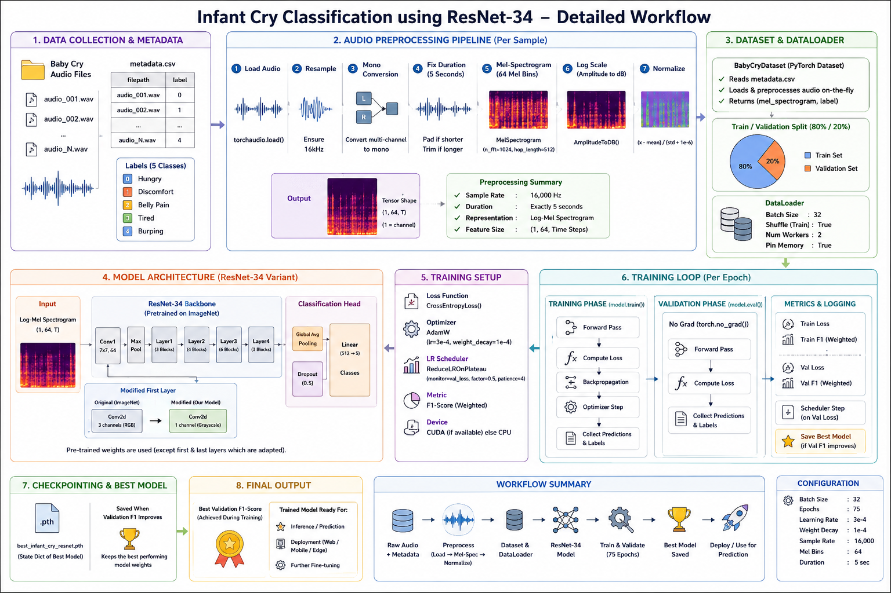
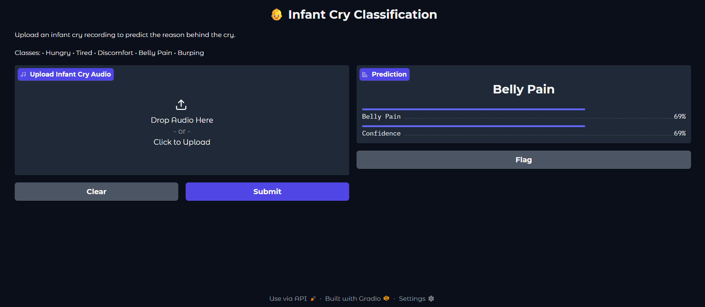
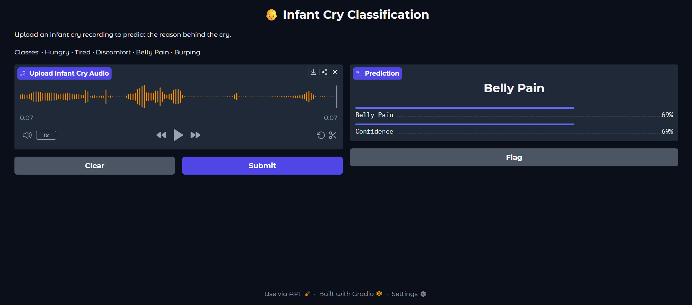
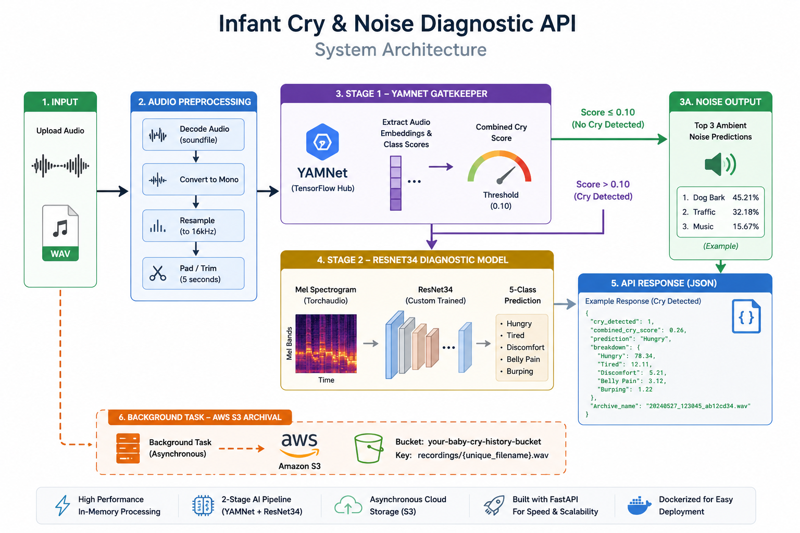

# 👶 Infant Cry Classification using Deep Learning

A production-ready deep learning system for automatically classifying infant cries into five different categories using **PyTorch**, **Torchaudio**, and **ResNet34**.

The model converts raw infant cry recordings into Mel Spectrograms and leverages transfer learning to recognize the underlying reason behind the cry.

<p align="center">


</p>

## 📖 Project Overview

Understanding infant cries is a challenging task for new parents and healthcare professionals.

This project uses Deep Learning and Transfer Learning to automatically classify infant crying sounds into one of five categories:

- Hungry
- Tired
- Discomfort
- Belly Pain
- Burping

The pipeline converts raw audio into Mel Spectrograms before using a pretrained ResNet34 model for classification.

The project follows a modular production-ready architecture separating data preparation, dataset loading, model definition, training, evaluation, prediction, and deployment.

# ✨ Features

✔ Dataset balancing using random oversampling

✔ Automatic metadata generation

✔ PyTorch Dataset pipeline

✔ Audio preprocessing

✔ Mel Spectrogram generation

✔ Transfer Learning using ResNet34

✔ Automatic evaluation

✔ Confusion Matrix generation

✔ Classification Report generation

✔ Gradio Web Interface

✔ Production-ready folder structure

✔ Modular codebase

# ⚙ Installation

```bash
git clone https://github.com/yourusername/InfantCryClassification.git

cd InfantCryClassification

pip install -r requirements.txt

python src/app.py
```

## 📂 Project Structure

```text
InfantCryClassification/
│
├── data/
│   ├── raw/
│   ├── balanced/
│   └── metadata.csv
│
├── models/
│   └── best_infant_cry_resnet.pth
│
├── src/
│   ├── config.py
│   ├── utils.py
│   ├── dataset.py
│   ├── model.py
│   ├── train.py
│   ├── evaluate.py
│   ├── predict.py
│   └── app.py
│
├── requirements.txt
├── README.md
└── LICENSE
```

# 🎵 Dataset

The dataset contains infant crying recordings categorized into five classes.

| Class | Description |
|--------|------------|
| Hungry | Cry due to hunger |
| Tired | Cry caused by sleepiness |
| Discomfort | Wet diaper, uncomfortable position etc. |
| Belly Pain | Gastrointestinal discomfort |
| Burping | Need to burp after feeding |

Dataset balancing is performed using random oversampling to ensure equal class distribution.

# 🧠 Model Architecture

The project uses a pretrained **ResNet34** model as the feature extractor.

The first convolution layer is modified to accept a single-channel Mel Spectrogram instead of a three-channel RGB image.

The final classification layer is replaced with a custom classifier for five infant cry categories.

<p align="center">



</p>

# 🚀 Training

The model is trained using

- CrossEntropyLoss
- AdamW Optimizer
- ReduceLROnPlateau Scheduler

Audio Processing

- Sample Rate: 16000 Hz
- Duration: 5 seconds
- Mel Bands: 64
- FFT Size: 1024
- Hop Length: 512

# 🌐 Web Interface

The project includes a **Gradio-based interactive web application** that enables users to upload an infant cry recording and instantly receive the predicted cry category along with the model's confidence score.

### 🏠 Home Interface

<p align="center">
    
</p>

The home screen allows users to upload a `.wav` audio recording of an infant cry for analysis.

---

### 📊 Prediction Result

<p align="center">
    
</p>

After processing the uploaded audio, the application displays:

- ✅ Predicted Cry Category
- 📈 Confidence Score
- ⚡ Real-time inference using the trained ResNet34 model

# 🚀 Production REST API

The project includes a **production-ready FastAPI service** designed for real-time infant cry diagnosis. The API follows a **two-stage AI inference pipeline** that first verifies whether the uploaded audio actually contains an infant cry before performing detailed cry classification.

This design minimizes false predictions on environmental sounds and provides a more reliable inference pipeline for real-world deployment.

---

## 🏗 System Architecture

<p align="center">
    
</p>

---

## 🔄 Two-Stage AI Inference Pipeline

### **Stage 1 – Infant Cry Verification (YAMNet)**

The uploaded audio is first analyzed using **Google's YAMNet** model from TensorFlow Hub.

YAMNet extracts high-level acoustic embeddings and predicts hundreds of environmental sound classes.

The API combines the confidence scores of cry-related categories such as:

- Baby Cry
- Infant Cry
- Crying
- Sob
- Whimper
- Wail
- Scream

If the combined cry confidence is **below the predefined threshold**, the audio is considered environmental noise.

Instead of attempting cry classification, the API immediately returns the **Top-3 detected ambient sounds**.

This significantly reduces false-positive predictions.

---

### **Stage 2 – Infant Cry Diagnosis (ResNet34)**

If YAMNet confirms that an infant cry is present, the audio is processed further.

The preprocessing pipeline performs:

- Audio decoding
- Mono conversion
- Resampling to **16 kHz**
- Fixed-length padding/trimming (5 seconds)
- Mel Spectrogram generation
- Log-amplitude conversion
- Feature normalization

The generated Mel Spectrogram is then passed to a custom **ResNet34** classifier trained using transfer learning.

The classifier predicts one of five infant cry categories:

- Hungry
- Tired
- Discomfort
- Belly Pain
- Burping

---

## ☁ AWS Cloud Storage

Every uploaded audio recording is automatically archived to **Amazon S3** using FastAPI **Background Tasks**.

This asynchronous approach ensures that cloud uploads never block the inference pipeline, resulting in lower response latency.

Archived recordings can later be used for:

- Dataset expansion
- Model retraining
- Performance monitoring
- Audit history

---

## ⚡ API Features

- Two-stage AI inference pipeline
- FastAPI-based REST API
- Google YAMNet verification model
- Custom ResNet34 classifier
- Mel Spectrogram feature extraction
- Background AWS S3 archival
- Dockerized deployment
- JSON responses
- Real-time inference
- Production-ready architecture

---

## 📡 API Endpoint

### Predict Infant Cry

```http
POST /predict
```

### Request

Upload an audio file using **multipart/form-data**.

| Parameter | Type | Description |
|-----------|------|-------------|
| file | Audio (.wav) | Infant cry recording |

---

## ✅ Example Response (Cry Detected)

```json
{
  "cry_detected": 1,
  "combined_cry_score": 0.91,
  "prediction": "Hungry",
  "archive_name": "20260710_123045_ab12cd34.wav",
  "breakdown": {
    "Hungry": 91.42,
    "Tired": 2.64,
    "Discomfort": 1.88,
    "Belly Pain": 2.05,
    "Burping": 2.01
  }
}
```

---

## 🚫 Example Response (No Cry Detected)

```json
{
  "cry_detected": 0,
  "combined_cry_score": 0.04,
  "prediction": "Noise Detected",
  "archive_name": "20260710_124050_f34ab671.wav",
  "top_noises": {
    "Vacuum Cleaner": 46.81,
    "Speech": 28.34,
    "Music": 12.56
  }
}
```

---

## 🐳 Docker Deployment

Build the Docker image

```bash
docker build -t infant-cry-api .
```

Run the container

```bash
docker run -p 7860:7860 infant-cry-api
```


## 📈 Why a Two-Stage Pipeline?

Instead of directly classifying every uploaded sound, the system first determines **whether the audio actually contains an infant cry**.

This design offers several advantages:

- Reduces false-positive predictions
- Handles environmental noise gracefully
- Improves inference reliability
- Makes the API more suitable for real-world deployment
- Separates cry detection from cry diagnosis

# 🚀 Future Work

- EfficientNet backbone
- ConvNeXt backbone
- Vision Transformer
- ONNX Export
- TensorRT Optimization
- Mobile Deployment
- REST API
- Real-time Streaming Prediction

# 👨‍💻 Author

**Om Shinde**

AI/ML Engineer

LinkedIn: https://linkedin.com/in/omshinde01

GitHub: https://github.com/Omshinde01
